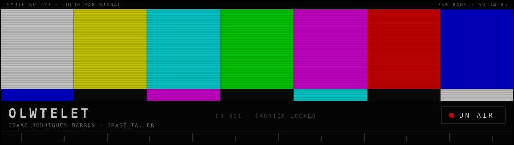

<!--
  ══════════════════════════════════════════════════════════════════
  OLWTELET — profile README · SMPTE broadcast theme
  Sections are numbered as broadcast channels (100–999).
  Local assets live in assets/ — see assets/README.md for maintenance.
  ══════════════════════════════════════════════════════════════════
-->

<!-- ═══ HERO ═══ -->

<div align="center">



<sub><code>░▒▓ CARRIER LOCKED · CH 001 · TRANSMITTING ▓▒░</code></sub>

<br><br>

```
$ signal --identify
OLWTELET — Isaac Rodrigues Barros
CS student · AI & automation · full-stack web — Brasília, BR
```

<a href="https://olwtelet.vercel.app"><kbd> ▶ PORTFOLIO </kbd></a>&ensp;<a href="https://www.linkedin.com/in/isaac-r-a8a777368/"><kbd> LINKEDIN </kbd></a>&ensp;<a href="mailto:olwtelet@outlook.com"><kbd> ✉ EMAIL </kbd></a>

</div>

<br>

<!-- ═══ INTRODUCTION ═══ -->

## `100` ▸ ABOUT

Computer Science student in Brasília, Brazil, working where AI meets software engineering.

I build automation pipelines that carry a job from raw input to published output, benchmark multi-agent frameworks side by side instead of taking the hype at face value, and ship full-stack web apps in TypeScript and React. The part I care about most comes after the demo works: architecture, tests, maintainability.

## `200` ▸ NOW TUNING

- Implementing and benchmarking ten AI agent frameworks — LangGraph, CrewAI, AutoGen, Pydantic-AI, and others — under a standardized interface in [AgentForge](https://github.com/Olwtelet/AgentForge)
- Growing a public knowledge vault of programming notes and study logs in [Obsidian-Second-Brain](https://github.com/Olwtelet/Obsidian-Second-Brain)

<!-- ═══ FEATURED PROJECTS ═══ -->

## `300` ▸ FEATURED TRANSMISSIONS

| `CH` | `PROGRAM` | `TRANSMISSION` |
|:--:|:--|:--|
| `301` | **[Resumex](https://github.com/Olwtelet/Resumex)** | Turns Reddit threads into ready-to-publish vertical videos: scrapes posts, scores viral potential, generates TTS narration, and renders Shorts with gameplay backdrops — end to end, no manual editing.<br><sub><code>Python · Selenium · PRAW · MoviePy · OpenCV</code></sub> |
| `302` | **[AgentForge](https://github.com/Olwtelet/AgentForge)** | Ten AI agent frameworks implemented side by side behind standardized interfaces, with benchmarks for latency, token usage, and tool efficiency, plus a Streamlit dashboard to compare them.<br><sub><code>Python · LangGraph · CrewAI · AutoGen · Streamlit</code></sub> |
| `303` | **[Portfolio-V1](https://github.com/Olwtelet/Portfolio-V1)** | First iteration of my personal site — minimalist, responsive, and built for fast page transitions. Live at [olwtelet.vercel.app](https://olwtelet.vercel.app).<br><sub><code>React · TypeScript · Vite</code></sub> |
| `304` | **[Obsidian-Second-Brain](https://github.com/Olwtelet/Obsidian-Second-Brain)** | Public knowledge vault: programming notes, cheatsheets, and study logs, organized with Zettelkasten and PARA so the connections between topics stay visible.<br><sub><code>Obsidian · Markdown</code></sub> |

<sub>Full schedule → [all repositories](https://github.com/Olwtelet?tab=repositories)</sub>

<!-- ═══ STACK ═══ -->

## `400` ▸ FREQUENCIES

```text
BAND         CARRIER SIGNAL                                STATUS
───────────  ────────────────────────────────────────────  ────────
LANGUAGES    Python · TypeScript · JavaScript · SQL        ● ON AIR
FRONTEND     React · Next.js · Vite                        ● ON AIR
BACKEND      Node.js · Express                             ● ON AIR
AI / DATA    NumPy · OpenCV · MoviePy · Selenium · PRAW    ● ON AIR
AI AGENTS    LangGraph · CrewAI · AutoGen · Pydantic-AI    ◌ TUNING
INFRA        Docker · Google Cloud · GH Actions · Vercel   ◌ TUNING
TOOLING      Git · Vitest · ESLint · Prettier              ● ON AIR
```

<sub><code>● ON AIR</code> — in regular use&ensp;·&ensp;<code>◌ TUNING</code> — actively learning</sub>

<!-- ═══ STATS ═══ -->

## `500` ▸ TELEMETRY

<div align="center">


<br><br>


</div>

<!-- ═══ CONTACT ═══ -->

## `600` ▸ OPEN CHANNEL

The fastest frequencies to reach me:

<a href="mailto:olwtelet@outlook.com"><kbd> ✉ olwtelet@outlook.com </kbd></a>&ensp;<a href="https://www.linkedin.com/in/isaac-r-a8a777368/"><kbd> LINKEDIN </kbd></a>&ensp;<a href="https://olwtelet.vercel.app"><kbd> PORTFOLIO </kbd></a>&ensp;<a href="https://x.com/Olwtelet"><kbd> X </kbd></a>&ensp;<a href="https://www.instagram.com/olwtelets"><kbd> INSTAGRAM </kbd></a>

<!-- ═══ FOOTER ═══ -->

<br>

<div align="center">

<sub><code>█▓▒░ END OF TRANSMISSION ░▒▓█</code></sub>
<br>
<sub><code>SIGNAL MAINTAINED FROM BRASÍLIA, BR</code></sub>

</div>

<!-- You're reading the raw feed. The carrier never really drops. — O. -->
