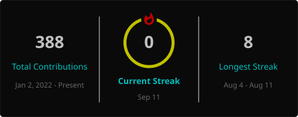

<!--
  ══════════════════════════════════════════════════════════════════
  OLWTELET — profile README · broadcast control-room theme
  Sections are numbered as channels. Local assets in assets/
  (see assets/README.md for maintenance). No JS, no external stats
  services — the only remote image is the contribution snake, which
  this repo's own workflow generates.
  ══════════════════════════════════════════════════════════════════
-->

<!-- ═══ HERO ═══ -->

<div align="center">



<sub><code>░▒▓ LIVE FEED · CH 001 · SIGNAL ORIGIN: BRASÍLIA, BR ▓▒░</code></sub>

<br><br>

<a href="https://olwtelet.vercel.app"><kbd> ▶ PORTFOLIO </kbd></a>&ensp;<a href="https://www.linkedin.com/in/isaac-r-a8a777368/"><kbd> LINKEDIN </kbd></a>&ensp;<a href="mailto:olwtelet@outlook.com"><kbd> ✉ EMAIL </kbd></a>

</div>


<!-- ═══ IDENTITY ═══ -->

## `100` ▸ IDENTITY

```text
CALL SIGN   OLWTELET — Isaac Rodrigues Barros
PROGRAM     Computer Science student
BROADCAST   AI & automation pipelines · multi-agent systems ·
            full-stack web, deployed for real clients
UPLINK      Brasília, Brazil
```

I'm drawn to the part of software that starts after the demo works: architecture, tests, maintainability. My open-source repos are working experiments; the client sites I've shipped are where those experiments meet the real world.

<!-- ═══ FEATURED PROJECTS ═══ -->

## `200` ▸ MISSION LOG

### `FEED A` — open source

#### `CH 201` · [AGENTFORGE](https://github.com/Olwtelet/AgentForge)

<sub><code>Python · LangGraph · CrewAI · AutoGen · Pydantic-AI · Streamlit</code></sub>

**Objective** — cut through agent-framework hype with evidence instead of opinions.<br>
**Build** — ten AI agent frameworks implemented behind one standardized interface, benchmarked for latency, token usage, and tool efficiency, with a Streamlit dashboard for side-by-side comparison.

#### `CH 202` · [RESUMEX](https://github.com/Olwtelet/Resumex)

<sub><code>Python · Selenium · PRAW · MoviePy · OpenCV</code></sub>

**Objective** — publish Reddit-story Shorts with zero manual editing.<br>
**Build** — an end-to-end pipeline: scrapes posts, scores viral potential, generates TTS narration, renders vertical video over gameplay backdrops, and uploads straight to YouTube.

<sub>Also transmitting: [Obsidian-Second-Brain](https://github.com/Olwtelet/Obsidian-Second-Brain) — public study vault of CS notes and logs, organized with Zettelkasten + PARA.</sub>

### `FEED B` — deployed for clients

| `CH` | `PROGRAM` | `TRANSMISSION` |
|:--:|:--|:--|
| `211` | **[Integratek](https://www.integratek.com.br/)** | Business site for an IT infrastructure company — blog and quote forms integrated with WhatsApp.<br><sub><code>Astro · Tailwind CSS</code></sub> |
| `212` | **[Rocha & Sá](https://rochaesa.vercel.app/)** | Law-firm website built for performance and SEO.<br><sub><code>Astro · Tailwind CSS</code></sub> |
| `213` | **[Instituto Politécnico do Brasil](https://instituto-politecnico-do-brasil.vercel.app)** | Institutional site for a nonprofit working in education, training, and civic outreach. |

<sub>Full schedule → [all repositories](https://github.com/Olwtelet?tab=repositories)</sub>

<!-- ═══ STACK ═══ -->

## `300` ▸ FREQUENCIES

```text
BAND         CARRIER SIGNAL                                STATUS
───────────  ────────────────────────────────────────────  ────────
LANGUAGES    Python · TypeScript · JavaScript · SQL        ● ON AIR
FRONTEND     React · Next.js · Astro · Tailwind · Vite     ● ON AIR
BACKEND      Node.js · Express                             ● ON AIR
AI / DATA    NumPy · OpenCV · MoviePy · Selenium · PRAW    ● ON AIR
AI AGENTS    LangGraph · CrewAI · AutoGen · Pydantic-AI    ◌ TUNING
INFRA        Docker · Google Cloud · GH Actions · Vercel   ◌ TUNING
TOOLING      Git · Vitest · ESLint · Prettier              ● ON AIR
```

<sub><code>● ON AIR</code> — in regular use&ensp;·&ensp;<code>◌ TUNING</code> — actively learning</sub>

<!-- ═══ STATS ═══ -->

## `400` ▸ TELEMETRY

<div align="center">



<br><br>


</div>

<!-- ═══ CONTACT ═══ -->

## `500` ▸ OPEN CHANNEL

The fastest frequencies to reach me:

<a href="mailto:olwtelet@outlook.com"><kbd> ✉ olwtelet@outlook.com </kbd></a>&ensp;<a href="https://www.linkedin.com/in/isaac-r-a8a777368/"><kbd> LINKEDIN </kbd></a>&ensp;<a href="https://olwtelet.vercel.app"><kbd> PORTFOLIO </kbd></a>&ensp;<a href="https://x.com/Olwtelet"><kbd> X </kbd></a>&ensp;<a href="https://www.instagram.com/olwtelets"><kbd> INSTAGRAM </kbd></a>

<!-- ═══ FOOTER ═══ -->


<div align="center">

<sub><code>█▓▒░ END OF TRANSMISSION ░▒▓█</code></sub>
<br>
<sub><code>SIGNAL MAINTAINED FROM BRASÍLIA, BR · OLW-TV</code></sub>

</div>

<!-- You're reading the raw feed. The carrier never really drops. — O. -->
