<!-- OLWTELET · profile README. Regions between tv:begin / tv:end are generated by `node tv/build.mjs` from tv/content.mjs. Edit the content file, not the generated markup. -->

<!-- tv:begin hero -->

<!-- tv:end hero -->

<!-- tv:begin remote -->

<!-- tv:end remote -->

Hi! I'm **Isaac Rodrigues**, a Computer Science student and full-stack developer based in Brasília, Brazil. I build web products, automation tools, and applied AI experiments — from client-facing platforms to RAG pipelines and agent-based systems. These days I also work on cybersecurity at [Ordfall](https://ordfall.vercel.app/en), treating security as part of the architecture rather than the last step.

<!-- tv:begin on-air -->

<b>FULL RESUME</b> · bio, on-air duties, skills, education, languages

 

I enjoy taking ideas from the first sketch to a deployed product: shaping the architecture, building the interface, connecting the back end, and polishing the details that make the experience feel alive — ideally in a constant state of Flow. Outside of code, I spend an unreasonable amount of time curating [playlists](https://olwtelet.vercel.app/en/playlists/).

**ORDFALL** · Full-Stack Developer & Cybersecurity Analyst · freelance, remote · Sep 2026 – present
- Built the company’s institutional website, presenting its secure software, cloud, data protection, and cybersecurity services.
- Develop and maintain applications at the intersection of software engineering, security, and digital governance.
- Help define scalable, maintainable architectures, with security designed in from the start through production.
- Perform vulnerability analysis and review code, dependencies, and security configurations; support cloud, identity, and infrastructure controls.

**INTEGRATEK** · Full-Stack Developer · ongoing client engagement · Jun 2026 – present
- Designed and developed the business website for an IT infrastructure company working with networking, structured cabling, CCTV, and access control.
- Built with Astro and TypeScript; containerized with Docker for reproducible deployment.
- Implemented a blog and quote request forms integrated with WhatsApp to support lead generation.
- Continuously improve SEO, performance, responsiveness, and accessibility, and ship new sections as the company needs them.
- Also contribute to portal, dashboard, automation, AI, and infrastructure projects, from requirements gathering to post-deployment support.

| SKILLS | WHAT I REACH FOR |
|:--|:--|
| **Languages & frameworks** | TypeScript, JavaScript, Python, SQL, React, Next.js, Vue.js, Svelte, Tailwind CSS, Vite, Node.js, Express, FastAPI, Astro; C# and Rust in specific projects |
| **Data & infrastructure** | Supabase/PostgreSQL, MongoDB, Mongoose, SQLite, REST APIs, Docker, GitHub Actions, Google Cloud Platform, Vercel, Linux |
| **Applied AI** | LLM integrations, RAG pipelines, multi-agent systems, MCP, NLP tooling, the Claude API on Amazon Bedrock and Vertex AI |
| **Security** | code and dependency review, Supabase RLS, secret scanning, signed updates, network security and risk management fundamentals |
| **Practices** | testing with Vitest and pytest, modular design, Git-based workflows, CI, accessibility, SEO |

**Education** · Independent Computer Science coursework through MIT OpenCourseWare — 6.0001, 6.006, 6.033, 6.036, 6.867 (2024 – 2026) 
**Spoken languages** · Portuguese (native), English (advanced)

<!-- tv:end on-air -->

<!-- tv:begin archive -->

OPEN&nbsp;WEBSITE: <a href="https://instituto-politecnico-do-brasil.vercel.app">INSTITUTO&nbsp;POLITÉCNICO&nbsp;DO&nbsp;BRASIL</a> · <a href="https://rochaesa.vercel.app/">ROCHA&nbsp;&&nbsp;SÁ</a> · <a href="https://www.integratek.com.br/">INTEGRATEK</a> · <a href="https://thalitacademy.vercel.app/">CT&nbsp;THALITA&nbsp;RODRIGUES</a> · <a href="https://filmeshdonlinegratis.vercel.app">FILMES&nbsp;HD&nbsp;ONLINE&nbsp;GRÁTIS</a> · <a href="https://ordfall.vercel.app/en">ORDFALL</a>

<b>OPEN ALL 10 FILES</b> · stacks, roles and links

 

**▸ OPEN SOURCE · 04 FILES** · <a href="https://olwtelet.vercel.app/en/open-source/">channel index</a>

**01 / ARGUS** — Self-hosted situational awareness platform that folds dozens of public feeds into one live map. 
OPEN SOURCE · STATUS: WORK IN PROGRESS · ROLE: Creator and maintainer · Python / FastAPI / Next.js / React / MapLibre GL / Tauri / Rust / Docker · AGPL-3.0 · <a href="https://olwtelet.vercel.app/en/projects/argus/">[OPEN FILE ►]</a> · <a href="https://github.com/Olwtelet/Argus">VIEW SOURCE ↗</a>

**02 / AGENTFORGE** — The same agent, built ten different ways — a runnable comparison of agent frameworks. 
OPEN SOURCE · STATUS: WORK IN PROGRESS · Python / uv / pytest / LLMs / RAG / MCP / Streamlit · <a href="https://olwtelet.vercel.app/en/projects/agentforge/">[OPEN FILE ►]</a> · <a href="https://github.com/Olwtelet/AgentForge">VIEW SOURCE ↗</a>

**03 / RESUMEX** — Turns a story file into a finished vertical video, entirely offline. 
OPEN SOURCE · STATUS: WORK IN PROGRESS · Python / FFmpeg / Kokoro / SQLite / Ollama · <a href="https://olwtelet.vercel.app/en/projects/resumex/">[OPEN FILE ►]</a> · <a href="https://github.com/Olwtelet/Resumex">VIEW SOURCE ↗</a>

**04 / OBSIDIAN SECOND BRAIN** — A public study vault: CS fundamentals, code snippets, and daily logs, all cross-linked. 
OPEN SOURCE · STATUS: WORK IN PROGRESS · Obsidian / Markdown / Git · <a href="https://olwtelet.vercel.app/en/projects/obsidian-second-brain/">[OPEN FILE ►]</a> · <a href="https://github.com/Olwtelet/Obsidian-Second-Brain">VIEW SOURCE ↗</a>

**▸ WEBSITES · 06 FILES** · <a href="https://olwtelet.vercel.app/en/websites/">channel index</a>

**05 / INSTITUTO POLITÉCNICO DO BRASIL** — Institutional website for a nonprofit working in education, training, and civic outreach. 
CLIENT WORK · STATUS: ONLINE · 2026 · ROLE: Full-Stack Developer · Tailwind CSS / JavaScript · <a href="https://olwtelet.vercel.app/en/projects/instituto-politecnico-do-brasil/">[OPEN FILE ►]</a> · <a href="https://instituto-politecnico-do-brasil.vercel.app">OPEN WEBSITE ↗</a>

**06 / ROCHA & SÁ** — Website for a Brazilian law firm working in civil and corporate law. 
CLIENT WORK · STATUS: ONLINE · 2026 · ROLE: Full-Stack Developer · Astro / TypeScript / Tailwind CSS · <a href="https://olwtelet.vercel.app/en/projects/rocha-e-sa/">[OPEN FILE ►]</a> · <a href="https://rochaesa.vercel.app/">OPEN WEBSITE ↗</a>

**07 / INTEGRATEK** — Business website and lead channel for an IT infrastructure company, still shipping. 
CLIENT WORK · STATUS: ACTIVE · 2026 · ROLE: Full-Stack Developer · Astro / TypeScript / Tailwind CSS / Docker · <a href="https://olwtelet.vercel.app/en/projects/integratek/">[OPEN FILE ►]</a> · <a href="https://www.integratek.com.br/">OPEN WEBSITE ↗</a>

**08 / CT THALITA RODRIGUES** — Website for a tennis and beach tennis training centre in Brasília. 
CLIENT WORK · STATUS: ONLINE · 2026 · ROLE: Full-Stack Developer & UI/UX Designer · Next.js / React / TypeScript · <a href="https://olwtelet.vercel.app/en/projects/thalit-academy/">[OPEN FILE ►]</a> · <a href="https://thalitacademy.vercel.app/">OPEN WEBSITE ↗</a>

**09 / FILMES HD ONLINE GRÁTIS** — Film curation platform and community archive built on an SMPTE test-card design system. 
PERSONAL PROJECT · STATUS: ACTIVE · 2026 · ROLE: Design, development, and curation · Astro / TypeScript / Supabase / PostgreSQL / CSS · <a href="https://olwtelet.vercel.app/en/projects/fhdog/">[OPEN FILE ►]</a> · <a href="https://filmeshdonlinegratis.vercel.app">OPEN WEBSITE ↗</a>

**10 / ORDFALL** — Institutional website for a software engineering and cybersecurity company, plus ongoing security work. 
CLIENT WORK · STATUS: ACTIVE · 2026 · ROLE: Full-Stack Developer & Cybersecurity Analyst · Next.js · <a href="https://olwtelet.vercel.app/en/projects/ordfall/">[OPEN FILE ►]</a> · <a href="https://ordfall.vercel.app/en">OPEN WEBSITE ↗</a>

<!-- tv:end archive -->

<!-- tv:begin certificates -->

<b>OPEN ALL 08 CERTIFICATES</b> · issuers, dates and verification links

 

| CERTIFICATE | ISSUER · DATE |
|:--|:--|
| [Tools of the Trade: Linux and SQL](https://www.coursera.org/account/accomplishments/verify/BDM6QII7T7ZT) | Google · Sep 2026 |
| [Connect and Protect: Networks and Network Security](https://www.coursera.org/account/accomplishments/verify/LVVYFPCE0OQL) | Google · Sep 2026 |
| [Claude with Google Cloud's Vertex AI](https://academy.claude.com/verify/4a532fbe6844cb8c1b87be2a988d1fe1) | Anthropic · Sep 2026 |
| [Play It Safe: Manage Security Risks](https://www.coursera.org/account/accomplishments/verify/RJ69NOHTV926) | Google · Aug 2026 |
| [Foundations of Cybersecurity](https://www.coursera.org/account/accomplishments/verify/LTLWBG6ION9N) | Google · Aug 2026 |
| [Claude with Amazon Bedrock](https://academy.claude.com/verify/ee7535c035d529cab753e49b6c751dc8) | Anthropic · Aug 2026 |
| [Building with the Claude API](https://academy.claude.com/verify/26984dbc08c3d79418a8b45adc87b1dd) | Anthropic · Aug 2026 |
| [Algoritmos e Lógica de Programação - O Curso COMPLETO](https://www.udemy.com/certificate/UC-733fee17-7de9-4cfe-830f-ceb0865649ee/) (Algorithms & Programming Logic) | Udemy · Aug 2026 |

<!-- tv:end certificates -->

<!-- tv:begin playlists -->

ON&nbsp;SPOTIFY: <a href="https://open.spotify.com/playlist/0rOUdPuqoErRWxtTQbRDFD">FILMES&nbsp;HD&nbsp;ONLINE&nbsp;GRÁTIS</a> · <a href="https://open.spotify.com/playlist/1kr8i36jGVEc3VVyXGxgYA">MADRUGADAS&nbsp;EM&nbsp;RÁDIO&nbsp;FM</a> · <a href="https://open.spotify.com/playlist/5CMmvE78xG3Cn6eyA7yAWh">CARRO&nbsp;VERMELHO</a> · <a href="https://open.spotify.com/playlist/04l8q20PHavWBOp6J6ZH6V">ANGELS&nbsp;FIGHT&nbsp;DEVILS&nbsp;WITH&nbsp;GRACE</a>

<!-- tv:end playlists -->

<!-- tv:begin signal-log -->

<!-- tv:end signal-log -->

<!-- tv:begin sign-off -->

<a href="https://olwtelet.vercel.app/en/">PORTFOLIO</a> · <a href="https://olwtelet.vercel.app/en/resume/">RESUME</a> · <a href="mailto:olwtelet@outlook.com">EMAIL:&nbsp;olwtelet@outlook.com</a> · <a href="https://www.linkedin.com/in/olwtelet/">LINKEDIN</a> · <a href="https://bsky.app/profile/olwtelet.bsky.social">BLUESKY</a> · <a href="https://instagram.com/olwtelets">INSTAGRAM</a> · <a href="https://olwtelet.vercel.app/">SITE IN PORTUGUESE (PT-BR)</a> <a href="#top">◄ RETURN TO CHANNEL 00</a>

<!-- tv:end sign-off -->
