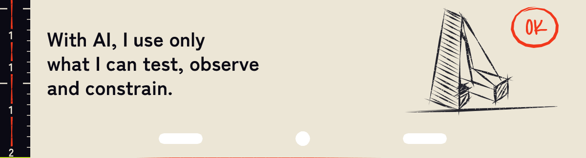
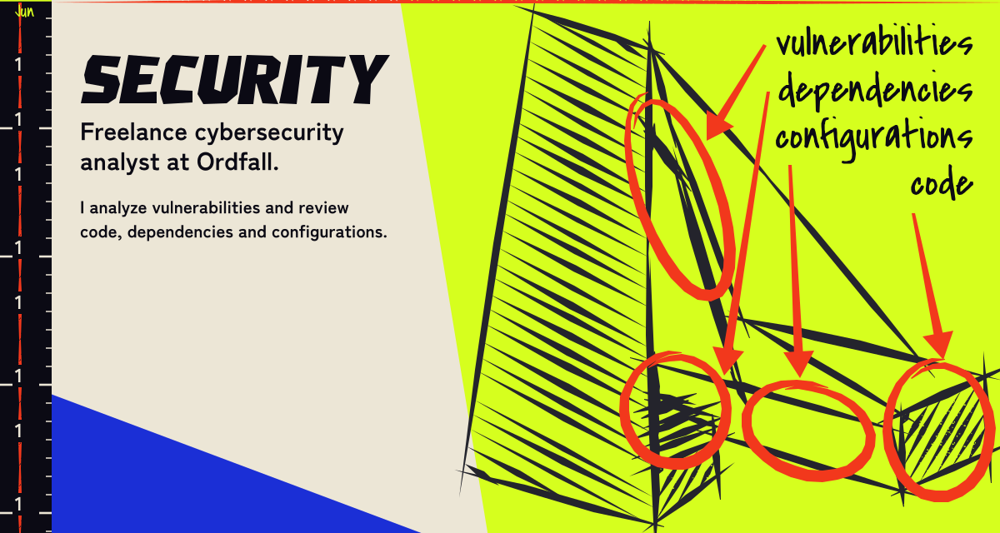

<!-- Generated by node film/build.mjs from film/content.mjs. Do not edit by hand. -->

Isaac Rodrigues. [Portfolio](https://olwtelet.vercel.app/en/), [resume](https://olwtelet.vercel.app/en/resume/), [olwtelet@outlook.com](mailto:olwtelet@outlook.com).

The same page, as plain text

**Isaac Rodrigues.** Computer Science student and full-stack developer in Brasília, Brazil, focused on applied AI and cybersecurity. I make games, software and websites at my studio, Olwtelet Productions. Olwtelet is my gaming handle and the name I put on my work.

A demo proves that software works once. What I care about is whether it keeps working with bad data, unexpected use and someone trying to break in.

With AI, I use only what I can test, observe and constrain.

**Security.** Freelance cybersecurity analyst at Ordfall: I analyze vulnerabilities and review code, dependencies and configurations.

**Olwtelet Productions.** My studio for games, software and websites. Live: [Filmes HD Online Grátis](https://filmeshdonlinegratis.vercel.app/), a film curation site; screenings happen live on Discord, and the site hosts no films. In development: Veil, a chess-like strategy game that runs in the browser, and Diseens, an academic passport platform.

**Open source.** [Obsidian Second Brain](https://github.com/Olwtelet/Obsidian-Second-Brain): a public study vault of CS fundamentals, code snippets and daily logs, all cross-linked. Work in progress.

**Stack and study.** TypeScript, Python, React, Next.js, Node.js, FastAPI. Independent CS coursework through MIT OpenCourseWare: 6.0001, 6.006, 6.033, 6.036, 6.867 (2024 to 2026). [Certificates](https://olwtelet.vercel.app/en/certificates/): Google (Linux and SQL; Networks and Network Security; Manage Security Risks; Foundations of Cybersecurity), Anthropic (Claude with Vertex AI; Claude with Amazon Bedrock; Building with the Claude API), Udemy (Algoritmos e Lógica de Programação). Portuguese (native), English (advanced).

**Elsewhere.** [LinkedIn](https://www.linkedin.com/in/olwtelet/), [GitHub](https://github.com/Olwtelet), [Konect](https://konect.gg/olwtelet), [ORCID](https://orcid.org/0009-0008-2485-7398), [projects](https://olwtelet.vercel.app/en/projects/).

**The strip.** The black strip down the left edge of the art has one row for each day from October 31, 2025 to October 30, 2026. A number is that day's contributions on GitHub; a red line is a day without any. 269 in all, longest run 8 days.

